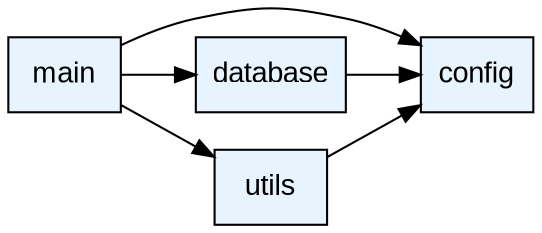

# 🗺️ DepMapper - Usage Examples

> 10 practical examples from basic scanning to full production workflows.

## Quick Navigation

- [Example 1: First Scan](#example-1-first-scan---getting-started)
- [Example 2: Dependency Tree](#example-2-dependency-tree---visualize-imports)
- [Example 3: Finding Circular Imports](#example-3-finding-circular-imports)
- [Example 4: Coupling Metrics](#example-4-coupling-metrics---health-check)
- [Example 5: Finding Dead Code](#example-5-finding-dead-code---orphan-modules)
- [Example 6: Full Report](#example-6-full-report---comprehensive-analysis)
- [Example 7: Python API](#example-7-python-api---programmatic-usage)
- [Example 8: Graphviz Visualization](#example-8-graphviz-visualization---visual-diagrams)
- [Example 9: CI/CD Integration](#example-9-cicd-integration---automated-quality-gates)
- [Example 10: Real Production Workflow](#example-10-real-production-workflow---analyzing-team-brain-tools)

---

## Example 1: First Scan — Getting Started

**Scenario:** You've just cloned a project and want to understand its structure.

**Steps:**

```bash
# Step 1: Verify DepMapper is available
python depmapper.py --version

# Step 2: Scan the project
python depmapper.py scan ./your_project
```

**Expected Output:**

```
DepMapper 1.0.0

[OK] Scan complete: /path/to/your_project
     Files: 14 | Modules: 14 | Dependencies: 10 | Time: 0.015s
```

**What You Learned:**
- How many Python files exist in the project
- How many local module dependencies were found
- Whether any files had parse errors
- How fast the scan completed

**Tip:** Use `--exclude` to skip directories:
```bash
python depmapper.py scan ./project --exclude "tests,migrations,docs"
```

---

## Example 2: Dependency Tree — Visualize Imports

**Scenario:** You want to see which modules import which.

**Steps:**

```bash
# Full tree for entire project
python depmapper.py tree ./your_project

# Tree starting from a specific module
python depmapper.py tree ./your_project --module main

# Limit tree depth
python depmapper.py tree ./your_project --depth 3
```

**Expected Output:**

```
[OK] Scan complete: ./your_project
     Files: 6 | Modules: 6 | Dependencies: 7 | Time: 0.010s

DEPENDENCY TREE
--------------------------------------------------
main
|-- config
|-- database
|   |-- models
|   `-- config
`-- utils
    `-- config
```

**What You Learned:**
- `main` depends on `config`, `database`, and `utils`
- `database` depends on `models` and `config`
- `config` is a shared dependency (high fan-in)
- There's a clear layered structure

**When `[circular]` Appears:**
```
main
|-- module_a
|   `-- module_b
|       `-- module_a [circular]
```
This means `module_a -> module_b -> module_a` is a circular import.

---

## Example 3: Finding Circular Imports

**Scenario:** Your project has mysterious `ImportError` at runtime — you suspect circular imports.

**Steps:**

```bash
python depmapper.py circular ./your_project
```

**Expected Output (cycles found):**

```
[OK] Scan complete: ./your_project
     Files: 8 | Modules: 8 | Dependencies: 12 | Time: 0.012s

[!] Found 2 circular import chain(s):

  Cycle 1: auth -> users -> auth
  Cycle 2: database -> models -> validators -> database
```

**Expected Output (clean project):**

```
[OK] Scan complete: ./your_project
     Files: 8 | Modules: 8 | Dependencies: 10 | Time: 0.011s

[OK] No circular imports detected!
```

**What You Learned:**
- Cycle 1: `auth` imports `users` which imports `auth` (2-module cycle)
- Cycle 2: `database -> models -> validators -> database` (3-module cycle)
- Exit code 0 = clean, exit code 2 = cycles found

**How to Fix Circular Imports:**
1. Move shared code to a new module (break the cycle)
2. Use lazy imports (import inside functions)
3. Reorganize to respect dependency direction

---

## Example 4: Coupling Metrics — Health Check

**Scenario:** You want to understand which modules are most critical (high fan-in) or most fragile (high instability).

**Steps:**

```bash
# Sort by instability (most unstable first)
python depmapper.py metrics ./your_project

# Sort by fan-in (most depended-on first)
python depmapper.py metrics ./your_project --sort fan_in

# Sort by fan-out (most dependent first)
python depmapper.py metrics ./your_project --sort fan_out

# JSON output for scripting
python depmapper.py metrics ./your_project --json
```

**Expected Output:**

```
COUPLING METRICS
----------------------------------------------------------------------
Module                                    Fan-In  Fan-Out  Instab.
----------------------------------------------------------------------
main                                           0        4    1.000 [!]
api                                            0        3    1.000 [!]
config                                         6        0    0.000 [stable]
utils                                          5        1    0.167 [stable]
models                                         3        2    0.400
database                                       2        3    0.600
```

**What You Learned:**
- `config` is the most stable module (fan-in=6, everything depends on it)
- `main` and `api` are entry points (fan-in=0, high instability is expected)
- `database` is moderately unstable — consider reducing its dependencies
- `[!]` marks modules with instability >= 0.8
- `[stable]` marks modules with instability <= 0.2 and fan-in > 0

**Interpreting Instability:**

| Range | Meaning | Action |
|-------|---------|--------|
| 0.0 - 0.2 | Stable core | Change carefully |
| 0.2 - 0.5 | Balanced | Normal maintenance |
| 0.5 - 0.8 | Leaning unstable | Review dependencies |
| 0.8 - 1.0 | Highly unstable | Expected for entry points; concerning for utilities |

---

## Example 5: Finding Dead Code — Orphan Modules

**Scenario:** Your project has grown and you suspect some modules are no longer used.

**Steps:**

```bash
python depmapper.py orphans ./your_project
```

**Expected Output:**

```
ORPHAN MODULES (4 found)
--------------------------------------------------
  main (entry point / orchestrator)
  setup (standalone / potential dead code)
  old_migration_v1 (standalone / potential dead code)
  test_helper (standalone / potential dead code)
```

**What You Learned:**
- `main` is an orphan but has fan-out — it's an entry point (expected)
- `setup` is standalone — probably the setup.py module (expected)
- `old_migration_v1` has no imports AND nothing imports it — likely dead code
- `test_helper` may be used by test framework but not imported by project code

**Decision Guide:**

| Orphan Type | Fan-Out | Likely Status |
|-------------|---------|---------------|
| Has fan-out | > 0 | Entry point, script, or orchestrator |
| No fan-out | 0 | Standalone script or dead code |

---

## Example 6: Full Report — Comprehensive Analysis

**Scenario:** You need a complete dependency analysis for documentation or review.

**Steps:**

```bash
# Text report to terminal
python depmapper.py report ./your_project

# JSON for automated processing
python depmapper.py report ./your_project --json

# Markdown for documentation
python depmapper.py report ./your_project --markdown -o DEPENDENCY_REPORT.md
```

**Expected Text Output (abbreviated):**

```
======================================================================
DEPMAPPER - DEPENDENCY ANALYSIS REPORT
======================================================================
Project: /path/to/your_project
Scanned: 14 Python files
Modules: 14
Dependencies: 10

======================================================================
DEPENDENCY TREE
----------------------------------------------------------------------
main
|-- utils
`-- config

======================================================================
CIRCULAR IMPORTS
----------------------------------------------------------------------
[OK] No circular imports detected!

======================================================================
COUPLING METRICS
----------------------------------------------------------------------
Module                           Fan-In  Fan-Out  Instab.
----------------------------------------------------------------------
config                                8        0    0.000
main                                  0        5    1.000
...

======================================================================
ORPHAN MODULES (no inbound imports)
----------------------------------------------------------------------
  main (entry point / orchestrator)

======================================================================
Report generated by DepMapper v1.0.0
======================================================================
```

**What You Learned:**
- Complete picture of project health in one command
- Save as Markdown for inclusion in project documentation
- JSON output is parseable by scripts for automation

---

## Example 7: Python API — Programmatic Usage

**Scenario:** You want to integrate DepMapper into your own Python scripts or tools.

**Steps:**

```python
from depmapper import DepMapper

# Initialize and scan
dm = DepMapper()
result = dm.scan("./my_project")

# Print summary
print(f"Files: {result.total_files}")
print(f"Modules: {len(result.modules)}")
print(f"Parse errors: {result.parse_errors}")
print(f"Scan time: {result.scan_time:.3f}s")

# Check for circular imports
cycles = dm.find_circular()
if cycles:
    print(f"\nWARNING: {len(cycles)} circular import(s)!")
    for cycle in cycles:
        print(f"  {' -> '.join(cycle)}")
else:
    print("\nNo circular imports - clean!")

# Get coupling metrics
metrics = dm.get_metrics(sort_by="fan_in")
print("\nTop 5 most depended-on modules:")
for m in metrics[:5]:
    print(f"  {m.module}: fan_in={m.fan_in}, instability={m.instability:.3f}")

# Query specific modules
print(f"\nWhat does 'main' import? {dm.get_imports_for('main')}")
print(f"What imports 'config'? {dm.get_importers_of('config')}")

# Classify imports
classified = dm.get_all_imports("main")
print(f"\nImport breakdown for 'main':")
print(f"  Stdlib: {classified['stdlib']}")
print(f"  Local: {classified['local']}")
print(f"  Third-party: {classified['third_party']}")
```

**Expected Output:**

```
Files: 6
Modules: 6
Parse errors: 0
Scan time: 0.010s

No circular imports - clean!

Top 5 most depended-on modules:
  config: fan_in=4, instability=0.000
  utils: fan_in=3, instability=0.250
  models: fan_in=2, instability=0.333

What does 'main' import? ['config', 'database', 'utils']
What imports 'config'? ['database', 'main', 'models', 'utils']

Import breakdown for 'main':
  Stdlib: ['os', 'sys']
  Local: ['config', 'database', 'utils']
  Third-party: []
```

**What You Learned:**
- Full Python API for programmatic integration
- All analysis methods available after a single `scan()` call
- Can query specific modules for targeted analysis
- Import classification separates stdlib, local, and third-party

---

## Example 8: Graphviz Visualization — Visual Diagrams

**Scenario:** You want a visual diagram of your project's dependencies.

**Steps:**

```bash
# Generate DOT format
python depmapper.py graph ./your_project -o deps.dot

# Render with Graphviz (install separately)
dot -Tpng deps.dot -o deps.png
dot -Tsvg deps.dot -o deps.svg
dot -Tpdf deps.dot -o deps.pdf
```

**Expected DOT Output:**



**What You Learned:**
- DOT format is a standard graph description language
- Graphviz renders it into PNG, SVG, PDF, etc.
- Circular import edges are highlighted in red by default
- Package `__init__.py` modules get green background
- Use `--no-highlight` to disable cycle highlighting

**Without Graphviz installed:**
The DOT file is still useful — paste it into online tools like [Graphviz Online](https://dreampuf.github.io/GraphvizOnline/).

---

## Example 9: CI/CD Integration — Automated Quality Gates

**Scenario:** You want to prevent circular imports from entering your codebase.

**Steps:**

Add to your CI pipeline (GitHub Actions example):

```yaml
# .github/workflows/deps.yml
name: Dependency Check
on: [push, pull_request]
jobs:
  check-deps:
    runs-on: ubuntu-latest
    steps:
      - uses: actions/checkout@v4
      - uses: actions/setup-python@v5
        with:
          python-version: '3.11'
      - name: Check for circular imports
        run: python depmapper.py circular ./src
      - name: Generate dependency report
        run: python depmapper.py report ./src --markdown -o deps-report.md
      - name: Upload report
        uses: actions/upload-artifact@v4
        with:
          name: dependency-report
          path: deps-report.md
```

**For shell scripts:**

```bash
#!/bin/bash
# pre-commit hook or CI step

echo "Checking for circular imports..."
python depmapper.py circular ./src
RESULT=$?

if [ $RESULT -eq 2 ]; then
    echo "BLOCKED: Circular imports detected! Fix before merging."
    exit 1
elif [ $RESULT -eq 0 ]; then
    echo "PASSED: No circular imports."
    exit 0
else
    echo "ERROR: DepMapper failed to run."
    exit 1
fi
```

**Coupling threshold check:**

```bash
# Fail if any module has instability > 0.9 (excluding entry points)
python depmapper.py metrics ./src --json | python -c "
import json, sys
data = json.load(sys.stdin)
bad = [m for m in data if m['instability'] > 0.9 and m['fan_in'] > 0]
if bad:
    for m in bad:
        print(f'  WARNING: {m[\"module\"]} instability={m[\"instability\"]}')
    sys.exit(1)
print('All modules within coupling thresholds.')
"
```

**What You Learned:**
- Exit code 2 = circular imports found (use in CI to block merges)
- JSON output enables custom threshold checks
- Markdown reports can be uploaded as build artifacts
- Works in any CI system (GitHub Actions, GitLab CI, Jenkins, etc.)

---

## Example 10: Real Production Workflow — Analyzing Team Brain Tools

**Scenario:** You want to analyze dependencies across a Team Brain tool project.

**Steps:**

```bash
# Full analysis of a Team Brain tool
cd C:\Users\logan\OneDrive\Documents\AutoProjects

# Scan SynapseLink
python DepMapper/depmapper.py report SynapseLink --markdown -o SynapseLink/DEPENDENCY_REPORT.md

# Check all tools for circular imports
for tool in AgentHealth ContextCompressor TokenTracker SynapseLink; do
    echo "=== Checking $tool ==="
    python DepMapper/depmapper.py circular $tool
done

# Generate visual graph for a complex tool
python DepMapper/depmapper.py graph CollabSession -o collabsession_deps.dot
```

**Using the Python API in a Team Brain workflow:**

```python
from depmapper import DepMapper
from pathlib import Path

# Analyze all tools in AutoProjects
tools_dir = Path("C:/Users/logan/OneDrive/Documents/AutoProjects")
dm = DepMapper()

results = {}
for tool_dir in sorted(tools_dir.iterdir()):
    if tool_dir.is_dir() and (tool_dir / ".git").exists():
        try:
            result = dm.scan(str(tool_dir))
            cycles = dm.find_circular()
            metrics = dm.get_metrics()
            results[tool_dir.name] = {
                "files": result.total_files,
                "deps": sum(len(t) for t in result.edges.values()),
                "cycles": len(cycles),
                "max_fan_in": max((m.fan_in for m in metrics), default=0),
            }
        except Exception:
            pass

# Report
print(f"{'Tool':<25} {'Files':>6} {'Deps':>6} {'Cycles':>7} {'Max Fan-In':>10}")
print("-" * 60)
for tool, data in sorted(results.items()):
    status = "[!]" if data["cycles"] > 0 else "[OK]"
    print(f"{tool:<25} {data['files']:>6} {data['deps']:>6} "
          f"{data['cycles']:>7} {data['max_fan_in']:>10} {status}")
```

**Expected Output:**

```
Tool                      Files   Deps  Cycles  Max Fan-In
------------------------------------------------------------
AgentHealth                   4      3       0          3 [OK]
ContextCompressor             3      2       0          2 [OK]
SynapseLink                  14     10       0         10 [OK]
TokenTracker                  4      3       0          3 [OK]
```

**What You Learned:**
- DepMapper can analyze any Python project instantly
- Batch analysis across multiple projects using the Python API
- Cross-reference dependency data with other Team Brain tools
- Identify the most depended-on modules across the entire ecosystem

---

## 📚 Additional Resources

- **Full Documentation:** [README.md](README.md)
- **Cheat Sheet:** [CHEAT_SHEET.txt](CHEAT_SHEET.txt)
- **Integration Plan:** [INTEGRATION_PLAN.md](INTEGRATION_PLAN.md)
- **Quick Start Guides:** [QUICK_START_GUIDES.md](QUICK_START_GUIDES.md)
- **GitHub:** https://github.com/DonkRonk17/DepMapper

---

**Built by ATLAS (Team Brain) | For Logan Smith / Metaphy LLC | February 14, 2026**
